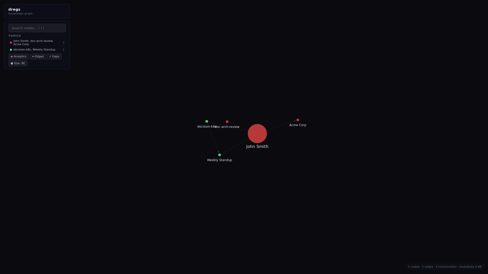

# dregs — 3 Fixed Graphs Architecture

*2026-04-12T21:34:27Z by Showboat 0.6.1*
<!-- showboat-id: 5ad26d4f-a7a0-488e-ad9f-35f48ce700a8 -->

One SQLite database = one knowledge domain. 3 fixed graphs: default (data + topics), urn:ontology (system + user vocabulary), urn:shacl (system + user shapes). System ontology ships dregs:Topic, dregs:Domain, dregs:RequiresDisplayName. Multiple domains = multiple databases.

## Tests

```bash
/usr/bin/python3 -m pytest tests/ -v --tb=short 2>&1 | tail -60
```

```output
============================= test session starts ==============================
platform linux -- Python 3.12.3, pytest-9.0.3, pluggy-1.6.0 -- /usr/bin/python3
cachedir: .pytest_cache
rootdir: /tmp/dregs
configfile: pyproject.toml
collecting ... collected 51 items

tests/test_core.py::TestInitV2::test_init_creates_three_graphs PASSED    [  1%]
tests/test_core.py::TestInitV2::test_init_loads_system_ontology PASSED   [  3%]
tests/test_core.py::TestInitV2::test_init_loads_user_ontology PASSED     [  5%]
tests/test_core.py::TestInitV2::test_init_loads_system_shapes PASSED     [  7%]
tests/test_core.py::TestInitV2::test_init_loads_user_shapes PASSED       [  9%]
tests/test_core.py::TestLoadV2::test_load_into_default_graph PASSED      [ 11%]
tests/test_core.py::TestLoadV2::test_load_rejects_bad_data PASSED        [ 13%]
tests/test_core.py::TestLoadV2::test_no_named_graphs_created PASSED      [ 15%]
tests/test_core.py::TestPromptV2::test_prompt_includes_user_classes PASSED [ 17%]
tests/test_core.py::TestPromptV2::test_prompt_excludes_system_classes PASSED [ 19%]
tests/test_core.py::TestPromptDomain::test_prompt_domain_filters_classes PASSED [ 21%]
tests/test_core.py::TestPromptDomain::test_prompt_domain_includes_properties PASSED [ 23%]
tests/test_core.py::TestNamespaceProtection::test_update_ontology_rejects_system_namespace PASSED [ 25%]
tests/test_core.py::TestNamespaceProtection::test_update_shacl_rejects_system_namespace PASSED [ 27%]
tests/test_core.py::TestExportV2::test_export_data_only PASSED           [ 29%]
tests/test_core.py::TestExportV2::test_export_ontology_user_only PASSED  [ 31%]
tests/test_core.py::TestExportV2::test_export_all PASSED                 [ 33%]
tests/test_core.py::TestInfoV2::test_stats_structure PASSED              [ 35%]
tests/test_core.py::TestDomains::test_create_domain PASSED               [ 37%]
tests/test_core.py::TestDomains::test_add_to_domain PASSED               [ 39%]
tests/test_core.py::TestDomains::test_list_domains_empty PASSED          [ 41%]
tests/test_core.py::TestTopics::test_create_topic PASSED                 [ 43%]
tests/test_core.py::TestTopics::test_topic_stored_in_default_graph PASSED [ 45%]
tests/test_core.py::TestTopics::test_list_topics_empty PASSED            [ 47%]
tests/test_core.py::TestDisplayNames::test_display_name_from_rdfs_label PASSED [ 49%]
tests/test_core.py::TestDisplayNames::test_display_name_fallback_to_uri PASSED [ 50%]
tests/test_core.py::TestDisplayNames::test_display_name_uri_path_fallback PASSED [ 52%]
tests/test_viz.py::TestBuildGraphData::test_returns_nodes_edges_analytics PASSED [ 54%]
tests/test_viz.py::TestBuildGraphData::test_nodes_have_required_fields PASSED [ 56%]
tests/test_viz.py::TestBuildGraphData::test_edges_have_required_fields PASSED [ 58%]
tests/test_viz.py::TestBuildGraphData::test_finds_entities PASSED        [ 60%]
tests/test_viz.py::TestBuildGraphData::test_finds_relationships PASSED   [ 62%]
tests/test_viz.py::TestBuildGraphData::test_no_schema_nodes PASSED       [ 64%]
tests/test_viz.py::TestAnalytics::test_community_detection PASSED        [ 66%]
tests/test_viz.py::TestAnalytics::test_betweenness_centrality PASSED     [ 68%]
tests/test_viz.py::TestAnalytics::test_analytics_metadata PASSED         [ 70%]
tests/test_viz.py::TestAnalytics::test_communities_have_structure PASSED [ 72%]
tests/test_viz.py::TestAnalytics::test_gap_detection PASSED              [ 74%]
tests/test_viz.py::TestAnalytics::test_node_sizing_varies PASSED         [ 76%]
tests/test_viz.py::TestAnalytics::test_bias_label_valid PASSED           [ 78%]
tests/test_viz.py::TestAnalytics::test_top_bc_nodes_have_fields PASSED   [ 80%]
tests/test_viz.py::TestAnalyticsDirect::test_empty_graph PASSED          [ 82%]
tests/test_viz.py::TestAnalyticsDirect::test_single_node PASSED          [ 84%]
tests/test_viz.py::TestAnalyticsDirect::test_two_clusters PASSED         [ 86%]
tests/test_viz.py::TestAnalyticsDirect::test_bridge_node_has_high_bc PASSED [ 88%]
tests/test_viz.py::TestServeViz::test_serves_html PASSED                 [ 90%]
tests/test_viz.py::TestServeViz::test_serves_api_graph PASSED            [ 92%]
tests/test_viz.py::TestServeViz::test_post_annotate PASSED               [ 94%]
tests/test_viz.py::TestServeViz::test_post_annotate_bad_json PASSED      [ 96%]
tests/test_viz.py::TestServeViz::test_sse_endpoint_connects PASSED       [ 98%]
tests/test_viz.py::TestServeViz::test_serves_api_analytics PASSED        [100%]

============================= 51 passed in 12.04s ==============================
```

## Initialize

```bash
export PATH=$HOME/.local/bin:$PATH && DREGS_DSN=/tmp/demo.db dregs init --ontology examples/ontology.ttl --shacl examples/shapes.ttl 2>/dev/null
```

```output
Initialized /tmp/demo.db
  System ontology: 35 triples
  User ontology:   116 triples
  System shapes:   48 triples
  User shapes:     48 triples
```

## Load Data

```bash
export PATH=$HOME/.local/bin:$PATH && DREGS_DSN=/tmp/demo.db dregs load examples/data_good.ttl 2>/dev/null
```

```output
Loaded 23 triples
```

## Info

```bash
export PATH=$HOME/.local/bin:$PATH && DREGS_DSN=/tmp/demo.db dregs info 2>/dev/null
```

```output
Database:  /tmp/demo.db
Version:   0.2.0
Created:   2026-04-12T21:34:55.752835+00:00
Data:      23 triples
Ontology:  151 triples
SHACL:     96 triples
Domains:   0
Topics:    0
```

## Prompt — Full Ontology

```bash
export PATH=$HOME/.local/bin:$PATH && DREGS_DSN=/tmp/demo.db dregs prompt 2>/dev/null | head -30
```

```output
# Ontology Schema for Extraction

Extract ONLY the following entity types and relationships.
Do NOT invent new types. Output as Turtle (TTL) format.

## Entity Types
### Activity
  Definition: Abstract: something that happens. Not used directly.

### Agent
  Definition: Abstract: an entity that acts. Not used directly.

### Artifact
  Definition: Abstract: a thing produced or referenced. Not used directly.

### Decision (subclass of Artifact)
  Definition: A Decision is an Artifact representing a formal choice with rationale.
  example: Approved migration to Kubernetes

### Document (subclass of Artifact)
  Definition: A Document is an Artifact representing a written work (report, memo, spec).
  example: Q3 Architecture Review document

### Meeting (subclass of Activity)
  Definition: A Meeting is an Activity where agents convene to discuss topics.
  example: Weekly standup on 2026-04-01

### Organization (subclass of Agent)
  Definition: An Organization is an Agent representing a company, team, or institution.
  example: Acme Corp
```

## Domains — Scoped Extraction

Domains group ontology classes. The prompt --domain flag filters to only those classes and their relevant properties.

```bash
export PATH=$HOME/.local/bin:$PATH && DREGS_DSN=/tmp/demo.db dregs create-domain people -n 'People' -c http://example.com/ontology#Person -c http://example.com/ontology#Organization 2>/dev/null && DREGS_DSN=/tmp/demo.db dregs domains 2>/dev/null
```

```output
Created domain 'people' with 2 classes
  people               2 classes  "People"
```

```bash
export PATH=$HOME/.local/bin:$PATH && DREGS_DSN=/tmp/demo.db dregs prompt --domain people 2>/dev/null
```

```output
# Ontology Schema for Extraction (domain: people)

Extract ONLY the following entity types and relationships.
Do NOT invent new types. Output as Turtle (TTL) format.

## Entity Types
### Organization (subclass of Agent)
  Definition: An Organization is an Agent representing a company, team, or institution.
  example: Acme Corp
  example: Engineering Team

### Person (subclass of Agent)
  Definition: A Person is an Agent representing a named individual.
  example: Jane Doe, VP of Engineering
  example: John Smith, software engineer at Acme Corp

## Relationships (Object Properties)
- attendedBy: Meeting -> Person
- authored: Person -> Document
- madeBy: Decision -> Person
- worksAt: Person -> Organization

## Data Properties
```

## Topics — First-Class Data

Topics live in the default data graph alongside everything else. Just instances of dregs:Topic.

```bash
export PATH=$HOME/.local/bin:$PATH && DREGS_DSN=/tmp/demo.db dregs create-topic leadership -n 'Leadership Team' -m http://example.com/ontology#alice -m http://example.com/ontology#bob 2>/dev/null && DREGS_DSN=/tmp/demo.db dregs topics 2>/dev/null && echo && DREGS_DSN=/tmp/demo.db dregs info 2>/dev/null
```

```output
Created topic 'leadership' with 2 members
  leadership           2 members  "Leadership Team"

Database:  /tmp/demo.db
Version:   0.2.0
Created:   2026-04-12T21:34:55.752835+00:00
Data:      27 triples
Ontology:  155 triples
SHACL:     96 triples
Domains:   1
Topics:    1
```

## Namespace Protection

System namespaces (urn:dregs:system#, urn:dregs:shapes#) are immutable.

```bash
export PATH=$HOME/.local/bin:$PATH
cat > /tmp/evil.ttl << 'EOF'
@prefix dregs: <urn:dregs:system#> .
@prefix owl: <http://www.w3.org/2002/07/owl#> .
dregs:EvilClass a owl:Class .
EOF
DREGS_DSN=/tmp/demo.db dregs update-ontology /tmp/evil.ttl 2>&1 | grep -o 'ValueError:.*' || true
```

```output
ValueError: Cannot modify system namespace (urn:dregs:system#). Subject urn:dregs:system#EvilClass is protected.
```

## Query

```bash
export PATH=$HOME/.local/bin:$PATH && DREGS_DSN=/tmp/demo.db dregs query 'SELECT ?person ?org WHERE { ?person a ex:Person . ?person ex:worksAt ?org }' 2>/dev/null
```

```output
person         | org        
---------------+------------
ex:person-john | ex:org-acme

(1 results)
```

## Export

```bash
export PATH=$HOME/.local/bin:$PATH && DREGS_DSN=/tmp/demo.db dregs export --what data 2>/dev/null | head -20
```

```output
@prefix dregs: <urn:dregs:system#> .
@prefix ex: <http://example.com/ontology#> .
@prefix prov: <http://www.w3.org/ns/prov#> .
@prefix rdfs: <http://www.w3.org/2000/01/rdf-schema#> .
@prefix xsd: <http://www.w3.org/2001/XMLSchema#> .

ex:decision-k8s a ex:Decision ;
    ex:date "2026-04-01" ;
    ex:description "Approved migration to Kubernetes for production workloads" ;
    ex:madeBy ex:person-john ;
    ex:producedAt ex:meeting-standup-apr1 ;
    ex:rationale "Better scaling, team familiarity, cost reduction vs current VMs" ;
    prov:wasDerivedFrom <http://example.com/docs/standup-2026-04-01.md> .

ex:doc-arch-review a ex:Document ;
    ex:authored ex:person-john ;
    ex:title "Q3 Architecture Review" ;
    prov:wasDerivedFrom <http://example.com/docs/standup-2026-04-01.md> .

<urn:dregs:topic#leadership> a dregs:Topic ;
```

## Visualization

```bash {image}
docs/demo/viz.png
```


