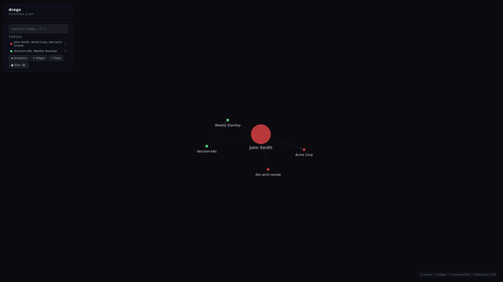

# dregs v2 — 3 Fixed Graphs Architecture

*2026-04-12T21:13:54Z by Showboat 0.6.1*
<!-- showboat-id: e5c7a5b5-c200-436f-bc87-aecdcac2abb2 -->

dregs v2 simplifies the architecture to 3 fixed graphs per SQLite database: default (data + topics), urn:ontology (system + user vocabulary), and urn:shacl (system + user shapes). System ontology provides dregs:Topic, dregs:Domain, and dregs:RequiresDisplayName. No named data graphs. No profiles. Multiple domains = multiple databases.

```bash
/usr/bin/python3 -m pytest tests/test_v2.py -v --tb=short 2>&1 | tail -35
```

```output
platform linux -- Python 3.12.3, pytest-9.0.3, pluggy-1.6.0 -- /usr/bin/python3
cachedir: .pytest_cache
rootdir: /tmp/dregs
configfile: pyproject.toml
collecting ... collected 27 items

tests/test_v2.py::TestInitV2::test_init_creates_three_graphs PASSED      [  3%]
tests/test_v2.py::TestInitV2::test_init_loads_system_ontology PASSED     [  7%]
tests/test_v2.py::TestInitV2::test_init_loads_user_ontology PASSED       [ 11%]
tests/test_v2.py::TestInitV2::test_init_loads_system_shapes PASSED       [ 14%]
tests/test_v2.py::TestInitV2::test_init_loads_user_shapes PASSED         [ 18%]
tests/test_v2.py::TestLoadV2::test_load_into_default_graph PASSED        [ 22%]
tests/test_v2.py::TestLoadV2::test_load_rejects_bad_data PASSED          [ 25%]
tests/test_v2.py::TestLoadV2::test_no_named_graphs_created PASSED        [ 29%]
tests/test_v2.py::TestPromptV2::test_prompt_includes_user_classes PASSED [ 33%]
tests/test_v2.py::TestPromptV2::test_prompt_excludes_system_classes PASSED [ 37%]
tests/test_v2.py::TestPromptDomain::test_prompt_domain_filters_classes PASSED [ 40%]
tests/test_v2.py::TestPromptDomain::test_prompt_domain_includes_properties PASSED [ 44%]
tests/test_v2.py::TestNamespaceProtection::test_update_ontology_rejects_system_namespace PASSED [ 48%]
tests/test_v2.py::TestNamespaceProtection::test_update_shacl_rejects_system_namespace PASSED [ 51%]
tests/test_v2.py::TestExportV2::test_export_data_only PASSED             [ 55%]
tests/test_v2.py::TestExportV2::test_export_ontology_user_only PASSED    [ 59%]
tests/test_v2.py::TestExportV2::test_export_all PASSED                   [ 62%]
tests/test_v2.py::TestInfoV2::test_stats_v2_structure PASSED             [ 66%]
tests/test_v2.py::TestDomains::test_create_domain PASSED                 [ 70%]
tests/test_v2.py::TestDomains::test_add_to_domain PASSED                 [ 74%]
tests/test_v2.py::TestDomains::test_list_domains_empty PASSED            [ 77%]
tests/test_v2.py::TestTopics::test_create_topic PASSED                   [ 81%]
tests/test_v2.py::TestTopics::test_topic_stored_in_default_graph PASSED  [ 85%]
tests/test_v2.py::TestTopics::test_list_topics_empty PASSED              [ 88%]
tests/test_v2.py::TestDisplayNames::test_display_name_from_rdfs_label PASSED [ 92%]
tests/test_v2.py::TestDisplayNames::test_display_name_fallback_to_uri PASSED [ 96%]
tests/test_v2.py::TestDisplayNames::test_display_name_uri_path_fallback PASSED [100%]

============================== 27 passed in 2.07s ==============================
```

## Initialize a v2 database

Create a new database with system ontology/shapes auto-loaded plus user ontology/shapes.

```bash
cd /tmp/dregs && /usr/bin/python3 -c "
from dregs.store import DregsStore
import tempfile, os

db = DregsStore('/tmp/demo-v2.db')
result = db.init_v2(
    ontology_path='examples/ontology.ttl',
    shacl_path='examples/shapes.ttl',
)
print('Init result:')
for k, v in result.items():
    print(f'  {k}: {v}')

stats = db.stats_v2()
print()
print('Stats:')
for k, v in stats.items():
    print(f'  {k}: {v}')
db.close()
"
```

```output
Init result:
  system_ontology_triples: 35
  user_ontology_triples: 116
  system_shacl_triples: 48
  user_shacl_triples: 48

Stats:
  data_triples: 0
  ontology_triples: 151
  shacl_triples: 96
  topics: 0
  domains: 0
  version: 0.2.0
  created_at: 2026-04-12T21:14:29.497691+00:00
```

## Load data into default graph

All data goes into a single unnamed default graph. Validated against urn:ontology + urn:shacl.

```bash
cd /tmp/dregs && /usr/bin/python3 -c "
from dregs.store import DregsStore
db = DregsStore('/tmp/demo-v2.db')
result = db.load_v2('examples/data_good.ttl')
print(f'Loaded: {result[\"loaded\"]}')
print(f'Triples: {result[\"triple_count\"]}')

stats = db.stats_v2()
print(f'Data triples: {stats[\"data_triples\"]}')
db.close()
"
```

```output
Loaded: True
Triples: 23
Data triples: 23
```

## Domains — scoped LLM extraction

Domains group ontology classes for filtered prompt generation. dregs:Domain instances live in urn:ontology.

```bash
cd /tmp/dregs && /usr/bin/python3 -c "
from dregs.store import DregsStore
from dregs.prompt import prompt_from_store_v2

db = DregsStore('/tmp/demo-v2.db')
db.create_domain('people', 'People', [
    'http://example.com/ontology#Person',
    'http://example.com/ontology#Organization',
])

domains = db.list_domains()
print('Domains:')
for d in domains:
    print(f'  {d[\"name\"]}: {len(d[\"classes\"])} classes')

print()
print('=== Filtered prompt (domain=people) ===')
print(prompt_from_store_v2(db, domain='people'))
db.close()
"
```

```output
Domains:
  People: 2 classes

=== Filtered prompt (domain=people) ===
# Ontology Schema for Extraction (domain: people)

Extract ONLY the following entity types and relationships.
Do NOT invent new types. Output as Turtle (TTL) format.

## Entity Types
### Organization (subclass of Agent)
  Definition: An Organization is an Agent representing a company, team, or institution.
  example: Engineering Team
  example: Acme Corp

### Person (subclass of Agent)
  Definition: A Person is an Agent representing a named individual.
  example: Jane Doe, VP of Engineering
  example: John Smith, software engineer at Acme Corp

## Relationships (Object Properties)
- attendedBy: Meeting -> Person
- authored: Person -> Document
- madeBy: Decision -> Person
- worksAt: Person -> Organization

## Data Properties
```

## Topics — first-class data

Topics are dregs:Topic instances in the default data graph. They can be created manually or detected automatically via community detection algorithms.

```bash
cd /tmp/dregs && /usr/bin/python3 -c "
from dregs.store import DregsStore

db = DregsStore('/tmp/demo-v2.db')
db.create_topic('leadership', 'Leadership Team', [
    'http://example.com/ontology#alice',
    'http://example.com/ontology#bob',
])

topics = db.list_topics()
print('Topics:')
for t in topics:
    print(f'  {t[\"name\"]}: {len(t[\"members\"])} members')

stats = db.stats_v2()
print(f'Data triples: {stats[\"data_triples\"]} (includes topic triples)')
print(f'Topics: {stats[\"topics\"]}')
db.close()
"
```

```output
Topics:
  Leadership Team: 2 members
Data triples: 27 (includes topic triples)
Topics: 1
```

## Namespace Protection

System namespaces (urn:dregs:system#, urn:dregs:shapes#) are immutable. User update commands reject files containing system namespace triples.

```bash
cd /tmp/dregs && /usr/bin/python3 -c "
from dregs.store import DregsStore

db = DregsStore('/tmp/demo-v2.db')

evil = '/tmp/evil.ttl'
with open(evil, 'w') as f:
    f.write('@prefix dregs: <urn:dregs:system#> .\n')
    f.write('@prefix owl: <http://www.w3.org/2002/07/owl#> .\n')
    f.write('@prefix rdfs: <http://www.w3.org/2000/01/rdf-schema#> .\n')
    f.write('dregs:Topic rdfs:label \"Hacked\" .\n')
    f.write('dregs:EvilClass a owl:Class .\n')

try:
    db.update_ontology(evil)
    print('ERROR: should have raised')
except ValueError as e:
    print(f'Protected! {e}')

db.close()
"
```

```output
Protected! Cannot modify system namespace (urn:dregs:system#). Subject urn:dregs:system#EvilClass is protected.
```

## Display Name Resolution

Standard property fallback chain: rdfs:label > skos:prefLabel > schema:name > foaf:name > dcterms:title. Falls back to URI fragment.

```bash
cd /tmp/dregs && /usr/bin/python3 -c "
from dregs.store import DregsStore
from dregs.display import get_display_name

db = DregsStore('/tmp/demo-v2.db')
print('Display names:')
print(f'  alice: {get_display_name(\"http://example.com/ontology#alice\", db)}')
print(f'  bob: {get_display_name(\"http://example.com/ontology#bob\", db)}')
print(f'  unknown: {get_display_name(\"http://example.com/test#SomeEntity\", db)}')
print(f'  path: {get_display_name(\"http://example.com/things/my-thing\", db)}')
db.close()
"
```

```output
Display names:
  alice: alice
  bob: bob
  unknown: SomeEntity
  path: my-thing
```

## Visualization

The viz server loads data from the default graph and uses topics for coloring.

```bash {image}
docs/demo/v2-viz.png
```


